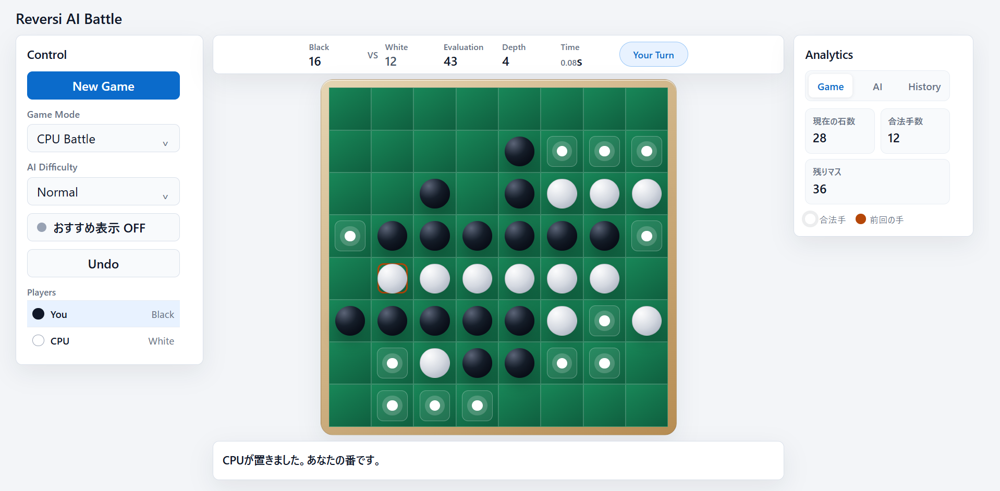

# Reversi AI Battle

ブラウザでCPU対戦またはローカル2人対戦を楽しめる、Spring Boot製のリバーシアプリケーションです。

CPU対戦ではNew Gameごとに先攻・後攻がランダムに決まり、4段階の難易度、おすすめ手、AI評価情報を利用できます。ローカル2人対戦では、同じ画面を使って黒と白を交互に操作します。

## スクリーンショット

## 主な機能

### ゲーム

- 8×8盤面、合法手判定、石の反転
- CPU Battle / Local 2 Playersの切り替え
- CPU対戦時の先攻・後攻ランダム決定
- CPU先攻時の自動初手
- 合法手がない場合の自動パス
- 終局判定、石数集計、勝敗表示
- 合法手、おすすめ手、直前手の強調表示
- New Gameと連続Undo

### AI

- Easy / Normal / Hard / Ultimateの4段階
- αβ探索による着手選択
- Ultimateでの反復深化、手の並び替え、置換表、終盤探索
- 評価値、探索深さ、思考時間の表示
- ユーザー向けおすすめ手の探索

### UI

- Control / Board / Analyticsの3カラム構成
- スコア、手番、AI情報をまとめたステータスバー
- Game / AI / Historyを切り替えられるAnalyticsタブ
- 画面幅と高さに応じたレスポンシブ表示
- デスクトップ表示で盤面を優先した1画面レイアウト
- Ajaxによる盤面更新とCPU思考中表示
- 固定高メッセージ、固定幅数値、スクロールバー領域確保によるレイアウト安定化

## 画面構成

| 領域 | 内容 |
| --- | --- |
| Control | New Game、モード、AI難易度、おすすめ表示、Undo、プレイヤー情報 |
| Status Bar | 黒・白の石数、評価値、探索深さ、思考時間、現在の手番 |
| Board | 8×8盤面、合法手、おすすめ手、直前手 |
| Message | 手番、CPU着手、パス、終局などの状況 |
| Analytics / Game | 現在の石数、合法手数、残りマス |
| Analytics / AI | 評価値、探索深さ、探索時間、AI機能の状態 |
| Analytics / History | 現在は直前の着手位置を表示 |

画面幅が1120pxを超える場合は3カラムで表示し、ControlとAnalyticsだけを必要に応じて内部スクロールします。1120px以下では各領域を縦に並べます。高さ760px以下では、盤面を確保するためタイトル、余白、ステータスバー、メッセージ領域をさらに縮小します。

## 操作方法

1. **Game Mode**でCPU対戦またはローカル2人対戦を選択します。
2. CPU対戦では**AI Difficulty**を選択します。
3. 白い候補マークが表示された合法手をクリックします。
4. 必要に応じて、おすすめ表示やUndoを使用します。
5. **New Game**で現在のモードと難易度を維持したまま新しい対局を開始します。

### Undo

Undo履歴はセッション内に最大60件保存され、続けて複数回取り消せます。

| モード | Undoで戻る状態 |
| --- | --- |
| CPU Battle | ユーザーが着手する直前。ユーザーの手と、それに続くCPUの応手をまとめて取り消す |
| Local 2 Players | 直前のプレイヤーが着手する前 |

履歴がない場合とCPU思考中はUndoボタンが無効になります。New Game、モード変更、難易度変更を行うとUndo履歴は消去されます。

## ゲームモード

### CPU Battle

New Gameを開始するたびに、ユーザーとCPUの色がランダムに決まります。

| 状態 | ユーザー | CPU | 開始時 |
| --- | --- | --- | --- |
| ユーザー先攻 | 黒 | 白 | ユーザーから着手 |
| ユーザー後攻 | 白 | 黒 | CPUが自動で初手を着手 |

CPU思考中は盤面操作とUndoを一時的に無効化し、ユーザーの石を表示してからCPU探索を実行します。

### Local 2 Players

同じ画面でPlayer 1（黒）とPlayer 2（白）が交互に操作します。CPU探索、AI難易度、おすすめ表示、AIステータスは使用しません。合法手がない場合は自動的に相手へ手番が移ります。

## AI難易度

| 難易度 | 探索 |
| --- | --- |
| Easy | 深さ1の探索（自分の着手のみ評価） |
| Normal | 深さ2の探索（相手の応手まで考慮） |
| Hard | 深さ4の探索 |
| Ultimate | 深さ6の反復深化、αβカット、手の並び替え、評価関数強化、終盤探索、置換表、時間制限付き探索 |

Ultimateは通常局面では深さ6まで反復深化し、残り12マス以下ではパスも考慮して終局まで探索を延長します。思考時間は最大3秒程度を目安にしています。

## おすすめ手

CPU Battleでは、ユーザーの合法手から選んだおすすめ手を黄色い「★」で表示できます。初期状態はOFFです。

評価には、角・辺・危険マス、双方の合法手数、石数差、終盤局面、浅いαβ探索を使用します。CPU思考中、パス時、終局時、Local 2 Playersでは表示されません。

## Analyticsについて

- EvaluationはAIが返した局面評価値です。
- DepthとSearch Timeは直近のCPU探索結果です。
- Historyは現時点では直前手のみ表示し、完全な棋譜は未実装です。
- Visited Nodesは未計測のため「--」を表示します。
- Transposition TableとMove OrderingはAIで利用している機能を示します。

## 非同期更新

盤面操作、CPU着手、New Game、おすすめ表示、UndoはFetch APIで更新します。JavaScriptが利用できない場合に備え、主要操作には通常のPOSTエンドポイントも用意しています。

主なAPIは次のとおりです。

| メソッド | パス | 用途 |
| --- | --- | --- |
| POST | /api/player-move | ユーザーまたはローカルプレイヤーの着手 |
| POST | /api/cpu-move | CPUの着手 |
| POST | /api/reset | 新しい対局 |
| POST | /api/recommendation | おすすめ表示の切り替え |
| POST | /api/undo | 直前状態への復元 |

## 実行方法

### ローカル

必要な環境:

- Java 21
- Maven

~~~bash
mvn spring-boot:run
~~~

起動後、[http://localhost:8080](http://localhost:8080)へアクセスします。

ビルド確認:

~~~bash
mvn clean test
~~~

現在、リポジトリには自動テストコードがないため、このコマンドではコンパイルとSpring Bootのビルド整合性を確認します。

### Docker

~~~bash
docker compose up --build
~~~

起動後、[http://localhost:8080](http://localhost:8080)へアクセスします。

停止とコンテナ削除:

~~~bash
docker compose down
~~~

## 使用技術

- Java 21
- Spring Boot 3.3.5
- Thymeleaf
- HTML / CSS / JavaScript
- Fetch API
- Docker / Docker Compose

## データ管理

データベースは使用せず、次の情報をHttpSessionに保存します。

- 盤面、手番、石数、直前手、終局状態、勝敗
- ゲームモード、難易度、ユーザーとCPUの色
- AI評価値、探索深さ、思考時間
- おすすめ表示設定
- Undo用の盤面スナップショット（最大60件）

盤面スナップショットは石配置だけでなく、手番、直前手、勝敗、AI情報を含めて複製します。

## 構成

~~~text
reversi-ai-battle/
├── Dockerfile
├── docker-compose.yml
├── pom.xml
├── README.md
└── src/main/
    ├── java/com/example/reversi/
    │   ├── ReversiApplication.java
    │   ├── controller/ReversiController.java
    │   ├── model/
    │   │   ├── Board.java
    │   │   ├── Difficulty.java
    │   │   ├── Move.java
    │   │   └── SearchResult.java
    │   └── service/
    │       ├── AiService.java
    │       ├── BoardService.java
    │       ├── EvaluationService.java
    │       ├── GameService.java
    │       ├── MoveOrderingService.java
    │       └── TranspositionTable.java
    └── resources/
        ├── templates/index.html
        └── static/style.css
~~~

## 今後の改善案

- 完全な棋譜履歴と棋譜保存
- SGFなどへのエクスポート
- 評価値グラフと対局解析
- 探索ノード数の計測
- 勝敗数、難易度別成績の保存
- Undo履歴を利用したRedo
- 自動テストの追加

## 生成AIの利用

本アプリの開発では、仕様整理、ゲームロジックとAI探索の設計補助、HTML / CSS / JavaScriptの実装補助、UI改善、README整理に生成AIを利用しています。
